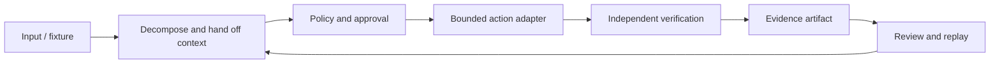

# Architecture

TrustOps Automation is an offline-first, dry-run-safe collaboration runtime. It owns orchestration contracts, role boundaries, handoffs, adapters, reproducible scenarios, evaluation, and evidence packaging. Mission Control is an external control-plane integration; its implementation and data are not included here.

## Boundary

- The default runtime is deterministic, in-memory, isolated, and dry-run.
- Production writes are disabled unless explicitly enabled by the caller.
- Real device, payment, and production Mission Control endpoints are supplied through local `.env` configuration and are not committed.
- Credentials and private infrastructure paths are never required in the repository.

## Closed-loop flow

Every scenario records a run identity, correlation identity, decision boundary, action result, verifier result, and replayable artifact. The vehicle-autonomy fixture is synthetic and simulation-only.

## Repository map

- `src/`: runtime and Mission Control HTTP adapter
- `agents/`, `skills/`, `tools/`: role, skill, and tool contracts
- `contracts/`: versioned schemas and compatibility declarations
- `scenarios/`: deterministic fixtures and failure cases
- `evals/`: executable contract and safety tests
- `deploy/`: isolated demo configuration
- `scripts/`: setup, evaluation, packaging, and validation helpers

## Integration model

Set `MISSION_CONTROL_BASE_URL` in `.env` to the isolated endpoint for your deployment. The public repository contains only the API compatibility boundary and local fixtures; it does not claim to ship or reproduce the external Mission Control service.
